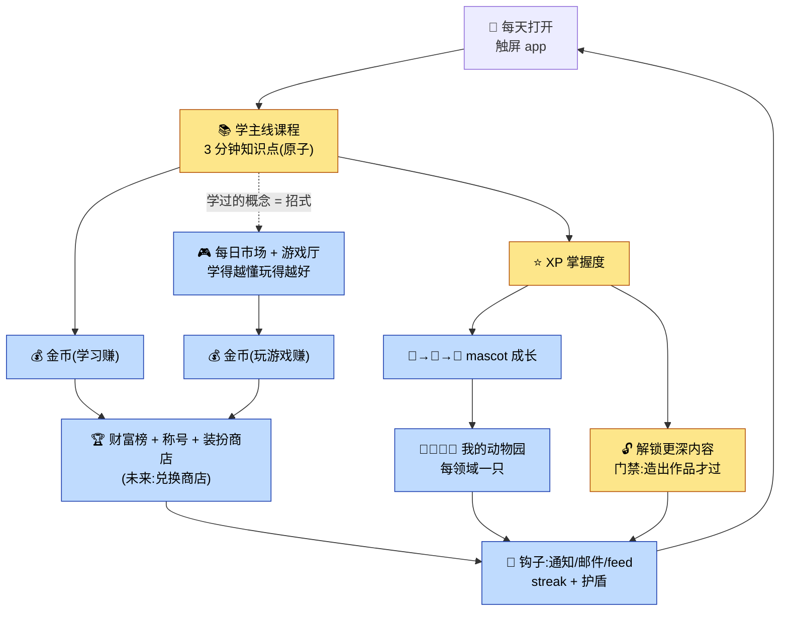
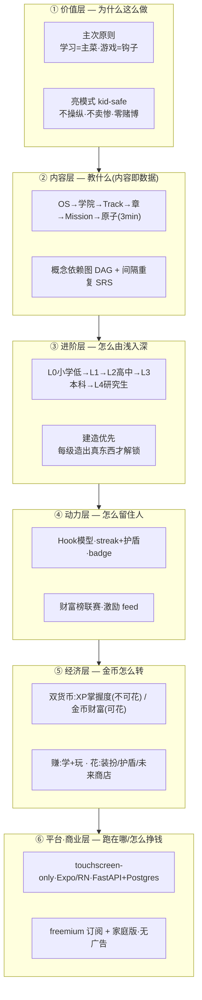
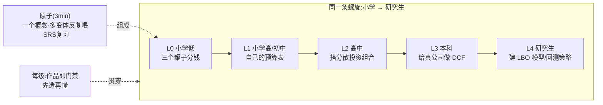
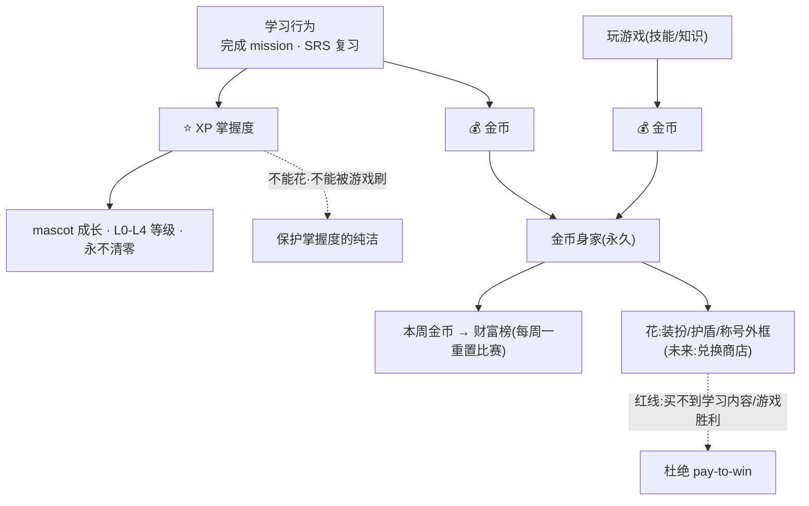
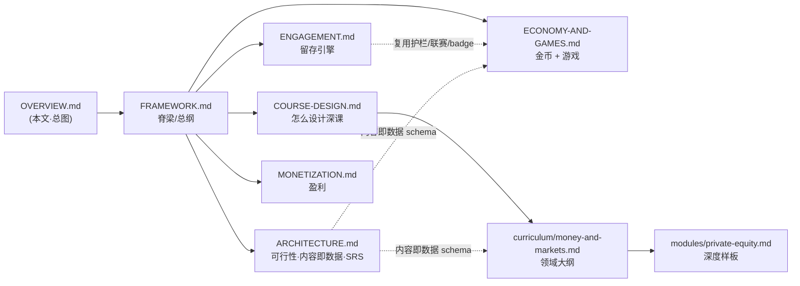

# 总览 — 现在的框架长什么样（Flowchart + 说明）

> 文档现在有 7 份，这是把它们串成**一个系统**的总图。先看图，再看说明，最后按"读法"跳到细节。
> 配套：[`FRAMEWORK.md`](./FRAMEWORK.md)（脊梁）· [`COURSE-DESIGN.md`](./COURSE-DESIGN.md) · [`ENGAGEMENT.md`](./ENGAGEMENT.md) · [`ECONOMY-AND-GAMES.md`](./ECONOMY-AND-GAMES.md) · [`ARCHITECTURE.md`](./ARCHITECTURE.md) · [`MONETIZATION.md`](./MONETIZATION.md) · [`curriculum/`](./curriculum/)

---

## 图 1 · 核心闭环（每日飞轮）—— 产品怎么转起来

> 一句话：**学得越懂 → 游戏玩得越好 → 金币越多 → 排名越高 → 越想回来 → 又去学。** "想赢钱"被导向"去学"。

**说明：** 黄色 = **主菜（学习）**，蓝色 = **钩子（mascot/游戏/金币/榜单/通知）**。
钩子的唯一职责是"把人吸引进来、拉回来"，所有箭头最终都汇回 **学主线课程**。
这张图就是 `FRAMEWORK.md` §0 主次原则 + `ECONOMY-AND-GAMES.md` §0 因果链的可视化。

---

## 图 2 · 分层架构 —— 框架由哪几层叠成

**说明：** 上层管"为什么/教什么"，下层管"怎么留人/怎么挣钱"。
**越往下越要服务越往上**——经济层(⑤)和动力层(④)都不能稀释内容层(②)的学习深度(这是①价值层的铁律)。

---

## 图 3 · 内容与进阶 —— 一个领域怎么从小学长到研究生

**说明：** 不是"儿童版+成人版"两个产品，而是**一根螺旋**：承重概念(如 TVM)在每一级以更深的形态 + 更硬的作品反复出现。
最小单位是 **3 分钟一个的原子**，像学语言一样多种方式反复喂(见 `COURSE-DESIGN.md`)。

---

## 图 4 · 双货币 —— XP 和金币各管一摊

**说明：** **XP = 掌握度**(只升级、不可花、不能被游戏刷)；**金币 = 财富**(学和玩都能赚、可花在纯装饰)。
两套分开，既满足"赚钱当 leader"，又不让游戏污染"学到多深"。详见 `ECONOMY-AND-GAMES.md` §1。

---

## 图 5 · 文档地图 —— 7 份文档怎么咬合

---

## 怎么读（按角色跳转）

| 你想搞清楚… | 看这张图 + 这份文档 |
|------------|---------------------|
| 产品整体怎么转 | 图 1 · `FRAMEWORK.md` |
| 教什么、教多深、什么顺序 | 图 3 · `COURSE-DESIGN.md` + `curriculum/` |
| 怎么让人每天回来 | 图 1/图 4 · `ENGAGEMENT.md` + `ECONOMY-AND-GAMES.md` |
| 技术能不能做、怎么扩 | 图 2 · `ARCHITECTURE.md` |
| 怎么挣钱 | 图 2 底层 · `MONETIZATION.md` |
| 一份深度内容长什么样 | `curriculum/modules/private-equity.md` |

---

## 现状一句话

**设计层已成体系**（7 份文档 + 一个深度样板模块），**尚未写一行产品代码**——这符合"先把内容/框架做深，再上工程"的节奏。
下一步候选见 `ECONOMY-AND-GAMES.md` §11 / `FRAMEWORK.md` §10（最强验证点 = 先做「每日市场」可玩样板）。
